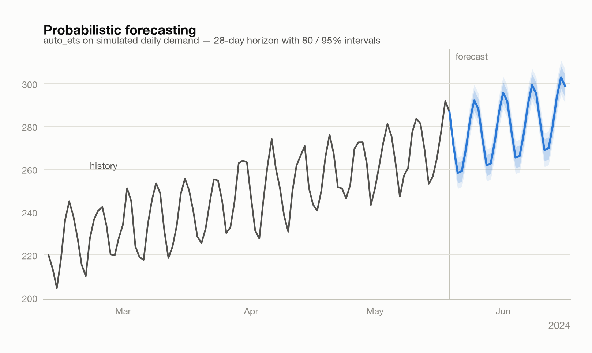
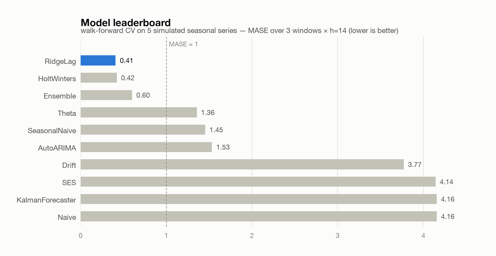
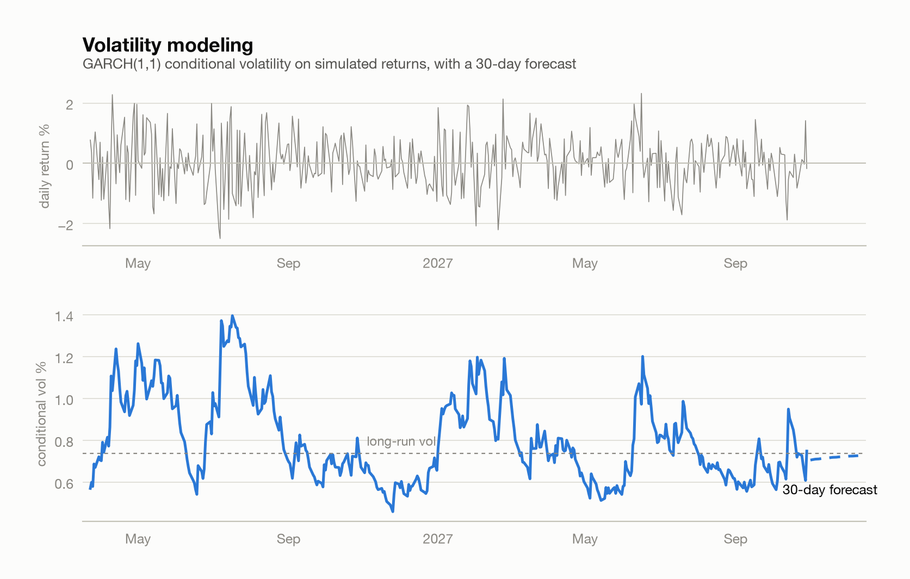
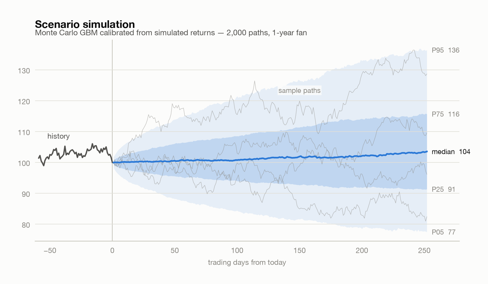
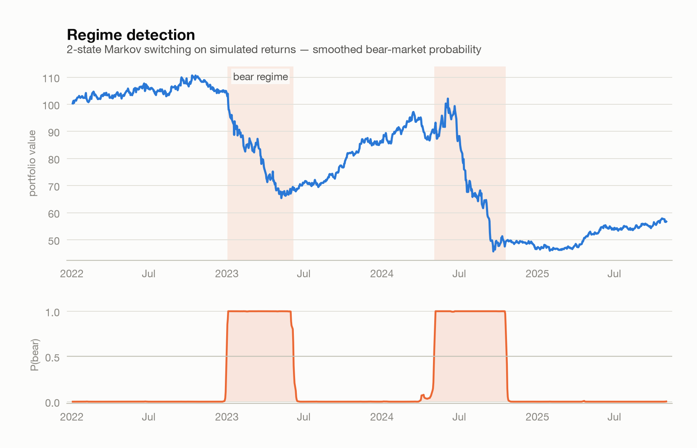
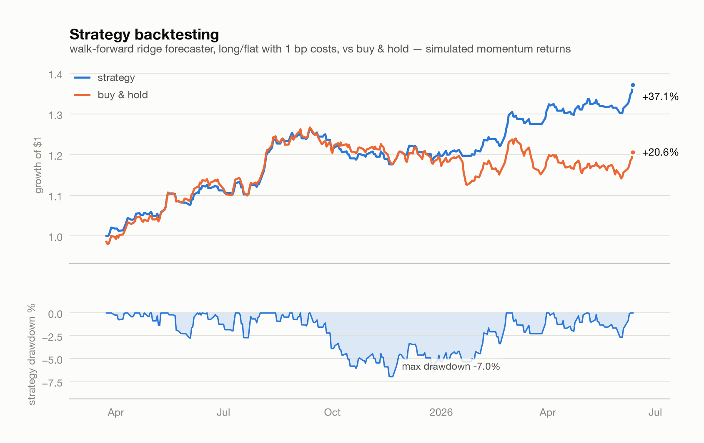

# forecast-os

[](https://github.com/milesc-bot/forecast-os/actions/workflows/ci.yml)
[](LICENSE)
[](pyproject.toml)

**An open-source forecasting engine: statistical, ML, and financial models behind one
unified API.** One data contract, one model interface, one evaluation harness — from
`naive` to ARIMA, Kalman filters, GARCH volatility, Monte Carlo simulation, and Markov
regime switching.

```
┌───────────────────────────────────────────────┐
│ Interface: ForecastEngine SDK · forecast-os CLI│
├───────────────────────────────────────────────┤
│ Model Registry (@register · get_model · list) │
├──────────────┬───────────────┬────────────────┤
│ Statistical  │ ML / Meta     │ Quant Finance  │
│ ETS · Theta  │ RidgeLag      │ GARCH(1,1)     │
│ ARIMA · SES  │ Ensemble      │ Monte Carlo    │
│ Kalman · ... │ AutoSelect    │ Regime-Switch  │
├──────────────┴───────────────┴────────────────┤
│ Uncertainty: native variance · conformal      │
├───────────────────────────────────────────────┤
│ Preprocessing: impute · scale · calendar · FFT│
├───────────────────────────────────────────────┤
│ Evaluation: walk-forward CV · MASE/RMSSE ·    │
│ Sharpe · max drawdown · leaderboards          │
└───────────────────────────────────────────────┘
```

## Why

The best open-source forecasting tools each own one slice: Nixtla's libraries own speed,
sktime owns the unified interface, qlib owns quant finance. **forecast-os** is a small,
dependency-light engine (numpy / pandas / scipy — no torch, no compiled extras) that puts
the three slices behind one contract, so you can go from raw series to a
cross-validated, probabilistic, finance-aware forecast in a few lines — and swap any
model for any other without changing a line of surrounding code.

- **One data contract** — every model consumes the long panel `(unique_id, ds, y)`
  (the Nixtla convention), datetime or integer time index, any number of series.
- **Probabilistic first** — every model emits prediction intervals: exact variance
  recursions where the theory provides them (ARIMA ψ-weights, Kalman covariance
  propagation, ETS), plus distribution-free split-conformal calibration for any model.
- **Evaluation built in** — walk-forward cross-validation and a leaderboard in two
  calls; scaled metrics (MASE, RMSSE) done correctly, and interval quality
  (coverage, Winkler, pinball, CRPS) scored through the same pipeline.
- **Finance is first-class** — GARCH volatility forecasts, GBM scenario simulation,
  bull/bear regime detection, and a strategy backtester that scores any forecaster with
  Sharpe / Sortino / max drawdown / hit rate.
- **An OS, not a monolith** — models plug in through a registry; a third-party package
  can `@register` its own forecaster and every engine feature (CV, ensembles,
  AutoSelect, conformal, CLI) works with it instantly.

## In action

Every figure below is produced by the engine itself on **seeded simulated data** —
regenerate them all with `python scripts/generate_figures.py`.

<picture>
  <source media="(prefers-color-scheme: dark)" srcset="docs/assets/forecast-dark.png">
  
</picture>

<table>
  <tr>
    <td width="50%">
      <picture>
        <source media="(prefers-color-scheme: dark)" srcset="docs/assets/leaderboard-dark.png">
        
      </picture>
    </td>
    <td width="50%">
      <picture>
        <source media="(prefers-color-scheme: dark)" srcset="docs/assets/garch-dark.png">
        
      </picture>
    </td>
  </tr>
  <tr>
    <td width="50%">
      <picture>
        <source media="(prefers-color-scheme: dark)" srcset="docs/assets/montecarlo-dark.png">
        
      </picture>
    </td>
    <td width="50%">
      <picture>
        <source media="(prefers-color-scheme: dark)" srcset="docs/assets/regimes-dark.png">
        
      </picture>
    </td>
  </tr>
</table>

<picture>
  <source media="(prefers-color-scheme: dark)" srcset="docs/assets/backtest-dark.png">
  
</picture>

## Install

```bash
pip install git+https://github.com/milesc-bot/forecast-os
# optional heavy backends:
pip install "forecast-os[nixtla] @ git+https://github.com/milesc-bot/forecast-os"
```

Development install:

```bash
git clone https://github.com/milesc-bot/forecast-os && cd forecast-os
python3 -m venv .venv && source .venv/bin/activate
pip install -e ".[dev]" && pytest
```

## Quickstart

```python
import forecast_os as fos

# Any long-format DataFrame with columns unique_id, ds, y
df = fos.load_air_passengers()

# 1. Forecast with prediction intervals
model = fos.get_model("auto_ets", season_length=12)
model.fit(df)
model.predict(h=12, level=[80, 95])
#     unique_id         ds   yhat  lo-80  hi-80  lo-95  hi-95
# AirPassengers 1961-01-01  447.2  432.7  461.7  425.1  469.4
# ...

# 2. Compare models with walk-forward cross-validation — point AND interval quality
engine = fos.ForecastEngine(models=["seasonal_naive", "theta", "auto_ets", "auto_arima"])
leaderboard = engine.compare(df, h=12, n_windows=3, seasonality=12,
                             metrics=["mase", "coverage"], level=[80])
print(leaderboard)          # ranked by MASE, with each model's 80% coverage

# 3. Calibrated intervals for ANY model via conformal prediction
conf = fos.ConformalForecaster(model=fos.get_model("theta", season_length=12))
conf.fit(df)
conf.predict(h=12, level=[90])
```

### Finance in five lines

```python
from forecast_os.finance import GARCH11, MonteCarloSimulator, MarkovRegimeSwitching
import numpy as np

returns = np.diff(np.log(prices))          # your daily log returns
vol = GARCH11().fit(returns)               # volatility model
vol.forecast_volatility(h=10)              # next-10-day conditional vol

mc = MonteCarloSimulator.from_returns(returns)
mc.summary(s0=prices[-1], h=252)           # 1-year price quantile fan

regimes = MarkovRegimeSwitching().fit(returns)
regimes.smoothed_probs_                    # bull/bear probabilities per day
```

### Backtest a forecast as a trading strategy

```python
from forecast_os.finance import StrategyBacktester

bt = StrategyBacktester(fos.get_model("ridge_lag", lags=10), cost_bps=1.0,
                        sizing="proportional")   # exposure scaled by forecast confidence
result = bt.run(returns_panel, test_size=250)    # walk-forward, refit each step
print(result.summary)   # sharpe, sortino, max_drawdown, VaR/CVaR, calmar, hit_rate...
```

Sizing rules: `"binary"` (long/flat), `"proportional"` (position =
`P(r > 0)`-scaled, from the model's prediction intervals), `"kelly"`
(fractional Kelly, capped at `max_leverage`).

### Go-to-market analytics

The `forecast_os.gtm` layer bridges CRM-shaped data (one row per opportunity,
deal, or event) into the engine and answers revenue questions directly:

```python
from forecast_os.gtm import to_panel, attainment_probability

panel = to_panel(opportunities, id_cols=["team", "rep"], date_col="close_date",
                 value_col="amount", freq="MS", agg="sum")

model = fos.get_model("reconciled", model="auto_ets", method="mint_ols")
model.fit(panel)                       # rep, team, and total forecasts that add up
fc = model.predict(h=6, level=[80])

attainment_probability(fc, quota={"total": 3_400_000}, level=80)
#  unique_id   expected      quota  p_attain
#      total  3188234.3  3400000.0     0.424
```

Plus funnel primitives (`stage_panel`, `conversion_rates`, `propagate`),
cohort retention forecasting (`retention_sbg`), driver-based forecasting
(pass covariate columns — e.g. marketing spend — to exog-aware models like
`ridge_lag`, with known future values via `predict(h, X_df=...)`), fiscal
calendars (`FiscalCalendar(start_month=2, scheme="4-4-5")`), and signed
`bias` / `pct_bias` governance metrics that catch sandbagged forecasts.

## Plug in your pipeline

Your GTM data lives in a CRM, a warehouse, or a product-analytics tool — the
`connectors` layer meets it there. **Mapping recipes** know the export shapes
of Salesforce, HubSpot, Pipedrive, Stripe, PostHog, GA4, Mixpanel, and
Amplitude (`forecast-os mappings` lists them):

```bash
forecast-os forecast deals.csv --mapping hubspot_deals --h 6 --model auto_select
```

```python
from forecast_os.connectors import HubSpotSource, SQLSource, apply_mapping

# REST APIs (pip install "forecast-os[connectors]"): paginated, token-auth
panel = HubSpotSource(token=HUBSPOT_TOKEN).to_panel(id_cols=("owner",))

# Any warehouse pandas can read — bring your own driver (DuckDB, Snowflake,
# BigQuery, Postgres):
panel = SQLSource("SELECT owner, close_date, amount FROM won_deals",
                  con=duckdb.connect("crm.db"),
                  mapping="salesforce_opportunities").to_panel()

# Or shape any records DataFrame yourself:
panel = apply_mapping(df, "posthog_events", freq="W")
```

### MCP server — let your agent drive the engine

`pip install "forecast-os[mcp]"` and register `forecast-os-mcp` with any MCP
client (Claude Desktop / Claude Code / your agent framework):

```json
{"mcpServers": {"forecast-os": {"command": "forecast-os-mcp"}}}
```

The server exposes `preview_panel`, `forecast`, `compare`, and
`quota_attainment` tools over CSV paths or inline records, so an agent can
map a raw export, sanity-check the panel, rank models, and report quota
attainment probability without writing pandas.

## CLI

```bash
forecast-os models                                  # list every installed model
forecast-os forecast data.csv --h 12 --model auto_ets --level 90 -o forecast.csv
forecast-os compare data.csv --h 12 --models naive,theta,auto_arima --metrics mase,smape
forecast-os simulate --s0 100 --mu 0.0004 --sigma 0.012 --h 252 --paths 5000
```

## Model zoo

| Name | Family | What it is |
|---|---|---|
| `naive`, `seasonal_naive`, `drift`, `window_average` | baseline | The benchmarks every real model must beat |
| `ses`, `holt`, `holt_winters` | statistical | Exponential smoothing (level / trend / seasonality), SSE-optimized |
| `auto_ets` | statistical | Picks the best ETS variant by AICc |
| `theta` | statistical | The M3-winning Theta method with deseasonalization |
| `arima`, `auto_arima` | statistical | ARIMA(p,d,q) via CSS; auto orders by AICc, ψ-weight intervals |
| `kalman` | statistical | Local level / local linear trend state space, MLE, exact interval growth |
| `ridge_lag` | ml | Ridge autoregression on lags + Fourier terms, recursive multi-step |
| `croston`, `tsb` | statistical | Intermittent-demand models for lumpy series (sparse enterprise bookings) |
| `ensemble` | ensemble | Mean / median / weighted combination of any members |
| `auto_select` | ensemble | Cross-validates candidates, picks the best model per series (seasonality-aware) |
| `conformal` | ensemble | Split-conformal calibrated intervals around any model |
| `reconciled` | ensemble | Hierarchical reconciliation (bottom-up / top-down / MinT) over `"team/rep"` ids |
| `garch` | financial | GARCH(1,1) conditional volatility forecasting |
| `retention_sbg` | gtm | Shifted-beta-geometric cohort retention with pooled shrinkage |

Plus non-registry finance tools: `GARCH11`, `MonteCarloSimulator`,
`MarkovRegimeSwitching`, `StrategyBacktester`, and metrics
(`sharpe_ratio`, `sortino_ratio`, `max_drawdown`, `value_at_risk`,
`conditional_var`, `calmar_ratio`, `hit_rate`, ...).

## Extending the OS

```python
import numpy as np
from forecast_os import PerSeriesForecaster, register

@register("last_median", family="baseline")
class LastMedian(PerSeriesForecaster):
    """Median of the trailing window."""
    def __init__(self, window: int = 5):
        self.window = window
    def _fit_series(self, y):
        return {"m": float(np.median(y[-self.window:]))}
    def _predict_series(self, state, h):
        return np.full(h, state["m"])
```

That's the whole integration: it now appears in `list_models()`, works in
`ForecastEngine.compare`, ensembles, AutoSelect, conformal wrapping, and the CLI.

## Design notes

- **Contract-tested**: `tests/test_contract.py` parametrizes over the registry, so every
  model — including yours — is automatically checked for panel round-tripping, interval
  ordering, clone/refit equivalence, and predict-before-fit errors.
- **Deterministic**: all stochastic components take a `seed`.
- **Honest uncertainty**: interval methods are documented per model; when a model has no
  variance theory, it falls back to in-sample residual std — or wrap it in `conformal`
  for distribution-free calibration.

## Roadmap

- Terminal console (OpenBB-style always-on TUI over the engine)
- Data connectors (warehouse / CRM export readers) and a snapshot store
- Foundation-model adapter (TimeGPT-style zero-shot baselines)
- Exogenous regressors for ARIMA (RidgeLag ships them today)
- REST serving layer

## Acknowledgments

The architecture follows the conventions proven by the open-source forecasting
community: the [Nixtla](https://github.com/Nixtla) panel data contract and
cross-validation output format, the [sktime](https://github.com/sktime/sktime) unified
estimator interface, and the financial-modeling scope of
[qlib](https://github.com/microsoft/qlib) and
[OxiDiviner](https://github.com/rustic-ml/OxiDiviner). None of these are dependencies —
they're prior art this engine gratefully builds on.

## License

MIT
